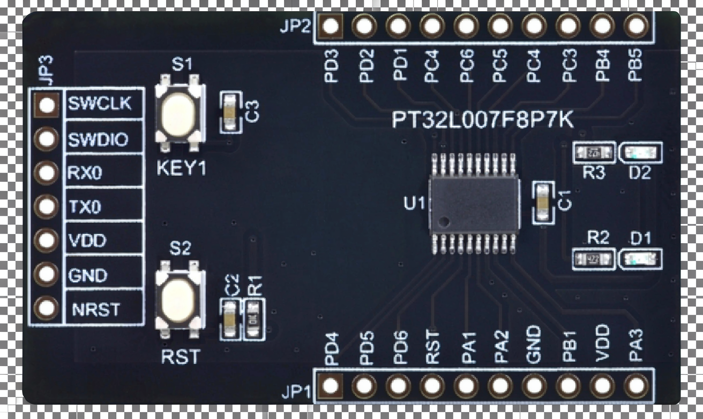

<!-- PROJECT LOGO -->
<br />
<p align="center">
  <a href="https://github.com/rp-rs/rp-hal">
    
  </a>

   <h3 align="center">pt32l007x-hal</h3>

  <p align="center">
    Rust support for the PT32L007x family of microcontrollers
    <br />
    <a href="https://github.com/IotaHydrae/pt32l007x-hal/tree/master/examples">View Demos</a>
    ·
    <a href="https://github.com/IotaHydrae/pt32l007x-hal/issues">Report a Bug</a>
  </p>
</p>

### Table of Contents

1. [Getting Started](#getting-started)
2. [Programming](#programming)
3. [Roadmap](#roadmap)
4. [Acknowledgements](#acknowledgements)
5. [Links](#links)

## Getting Started

This repository only includes examples suitable for the PT32L007F8P7K board.



Before trying any of the examples, please ensure you have the latest stable version of Rust installed, along with the right target support:

```bash
rustup self update
rustup update stable
rustup target add thumbv6m-none-eabi
```

You may also want to install probe-rs, to flash your device over the SWD pins with a debug probe:

```bash
cargo install --locked probe-rs-tools
```

## Packages

### [pt32l007x-pac](https://github.com/IotaHydrae/pt32l007x-pac) - PAC (Peripheral Access Crate) for PT32L007x MCUs

It is generated from a CMSIS-SVD format XML file of the microcontroller, such as the commonly known PT32L007x.svd.

### [pt32l007x-blink](https://github.com/IotaHydrae/pt32l007x-blink) - An example demo how to use PAC directly.

## Programming

### Loading with probe-rs

[probe-rs](https://github.com/probe-rs/probe-rs) is a library and a command-line tool which can flash a wide variety of microcontrollers using a wide variety of debug/JTAG probes. Unlike using, say, OpenOCD, probe-rs can autodetect your debug probe, which can make it easier to use.

*Step 1* - Install `probe-rs`:

```sh
cargo install --locked probe-rs-tools
```

Alternatively, follow the installation instructions on https://probe.rs/.

*Step 2* - Make sure your .cargo/config contains the following:

```toml
[target.thumbv6m-none-eabi]
runner = [
  "probe-rs",
  "run",
  "--chip-description-path",
  "PT32x007x.yaml",
  "--chip",
  "PT32F007F8P7",
  "--log-format=oneline",
]
```

*Step 3* - Connect your USB JTAG/debug probe (such as a Raspberry Pi Pico
running [this firmware](https://github.com/majbthrd/DapperMime)) to the SWD
programming pins on your PT32L007F8P7K board. Check the probe has been found by
running:

```console
$ probe-rs list
The following debug probes were found:
[0]: J-Link (J-Link) (VID: 1366, PID: 0101, Serial: 000099999999, JLink)
```

There is a SEGGER J-Link connected in the example above - the message you see
will reflect the probe you have connected.

*Step 4* - Use `cargo run`, which will compile the code and start the specified
'runner'. As the 'runner' is the `probe-rs` tool, it will connect to the
PT32L007x via the first probe it finds, and install your firmware into the Flash
connected to the PT32L007x.

```bash
cargo run --release --example blinky
```

If everything goes well, you should see the LED blinking.

## Roadmap

### embedded-hal

- [ ] delay
- [ ] gpio
- [ ] i2c
- [ ] spi

### embedded-graphics

## Acknowledgements

- [othneildrew's Best-README-Template](https://github.com/othneildrew/Best-README-Template)

- [rp-hal](https://github.com/rp-rs/rp-hal) & [arduino-uno-r4-hal](https://github.com/kanade-k-1228/arduino-uno-r4-hal)

## Links

- [PT32L007x Datasheet.pdf](https://img.pai-ic.com/files/076f326e480bb2690753cb613b47ee8e.pdf)

- [PT32x007x User Manual.pdf](https://img.pai-ic.com/files/9a634c19943beab82df2438615b6ad42.pdf)